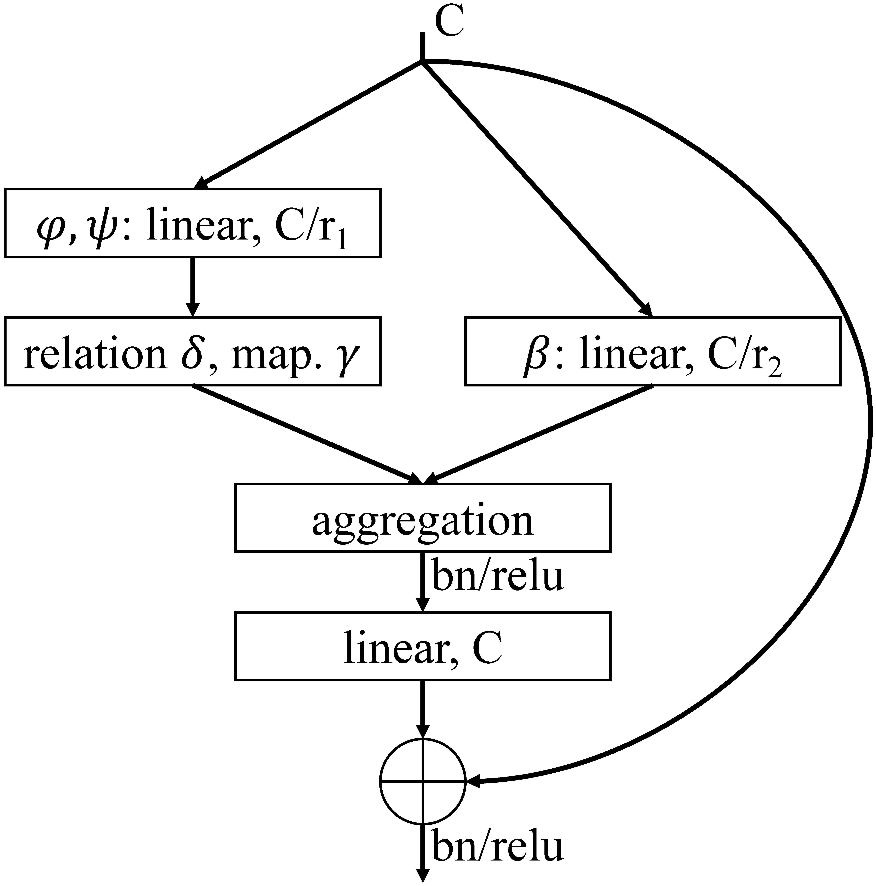

# Exploring Self-attention for Image Recognition
by Hengshuang Zhao, Jiaya Jia, and Vladlen Koltun, details are in [paper](https://hszhao.github.io/papers/cvpr20_san.pdf).

### Introduction

This repository is build for the proposed self-attention network (SAN), which contains full training and testing code. The implementation of SA module with optimized CUDA kernels are also included.

<p align="center"></p>

### Usage

1. Requirement:

   - Hardware: tested with 8 x Quadro RTX 6000 (24G).
   - Software: tested with PyTorch 1.4.0, Python3.7, CUDA 10.1, [CuPy](https://cupy.chainer.org/) 10.1, [tensorboardX](https://github.com/lanpa/tensorboardX).

2. Clone the repository:

   ```shell
   git clone https://github.com/hszhao/SAN.git
   ```
   
3. Train:

   - Download and [prepare](https://github.com/facebookarchive/fb.resnet.torch/blob/master/INSTALL.md) the ImageNet dataset (ILSVRC2012) and symlink the path to it as follows (you can alternatively modify the relevant path specified in folder `config`):

     ```
     cd SAN
     mkdir -p dataset
     ln -s /path_to_ILSVRC2012_dataset dataset/ILSVRC2012
     ```

   - Specify the gpus (usually 8 gpus are adopted) used in config and then do training:

     ```
     sh tool/train.sh imagenet san10_pairwise
     ```
     
   - If you are using [SLURM](https://slurm.schedmd.com/documentation.html) for nodes manager, uncomment lines in `train.sh` and then do training:

     ```shell
     sbatch tool/train.sh imagenet san10_pairwise
     ```

4. Test:

   - Download trained SAN [models](https://drive.google.com/open?id=19ZJn48UpiF_j8e1-UU9UZ4AVfLjmwPzH) and put them under folder specified in config or modify the specified paths, and then do testing:

     ```shell
     sh tool/test.sh imagenet san10_pairwise
     ```
   
5. Visualization:

   - [tensorboardX](https://github.com/lanpa/tensorboardX) incorporated for better visualization regarding curves:

     ```shell
     tensorboard --logdir=exp/imagenet
     ```

6. Other:

   - Resources: GoogleDrive [LINK](https://drive.google.com/open?id=19ZJn48UpiF_j8e1-UU9UZ4AVfLjmwPzH) contains shared models.

### Performance

Train Parameters: train_gpus(8), batch_size(256), epochs(100), base_lr(0.1), lr_scheduler(cosine), label_smoothing(0.1), momentum(0.9), weight_decay(1e-4).

Overall result:

| Method       | top-1 | top-5 | Params | Flops |
| :----------- | :---: | :---: | :----: | :---: |
| ResNet26     | 73.6  | 91.7  | 13.7M  | 2.4G  |
| SAN10-pair.  | 74.9  | 92.1  | 10.5M  | 2.2G  |
| SAN10-patch. | 77.1  | 93.5  | 11.8M  | 1.9G  |
| ResNet38     | 76.0  | 93.0  | 19.6M  | 3.2G  |
| SAN15-pair.  | 76.6  | 93.1  | 14.1M  | 3.0G  |
| SAN15-patch. | 78.0  | 93.9  | 16.2M  | 2.6G  |
| ResNet50     | 76.9  | 93.5  | 25.6M  | 4.1G  |
| SAN19-pair.  | 76.9  | 93.4  | 17.6M  | 3.8G  |
| SAN19-patch. | 78.2  | 93.9  | 20.5M  | 3.3G  |

### Citation

If you find the code or trained models useful, please consider citing:

```
@inproceedings{zhao2020san,
  title={Exploring Self-attention for Image Recognition},
  author={Zhao, Hengshuang and Jia, Jiaya and Koltun, Vladlen},
  booktitle={CVPR},
  year={2020}
}
```

